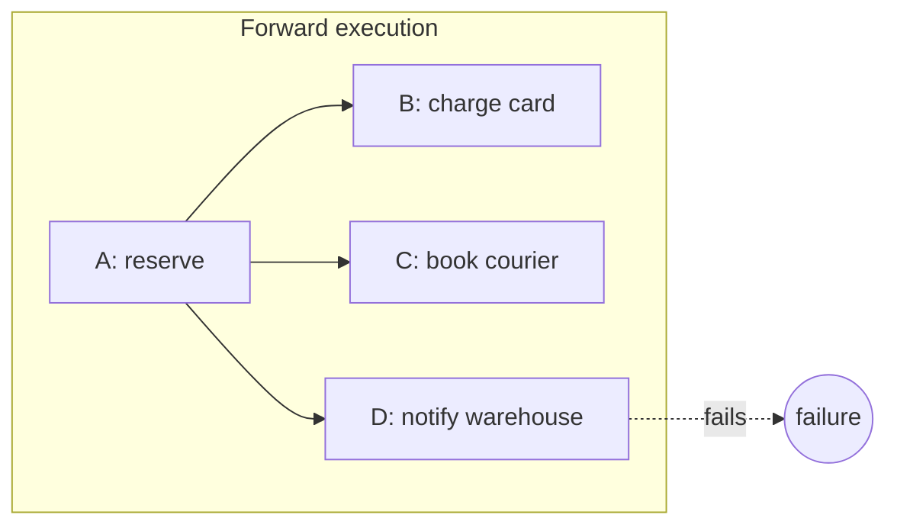
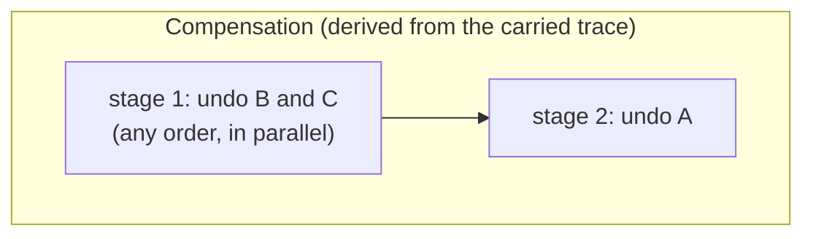
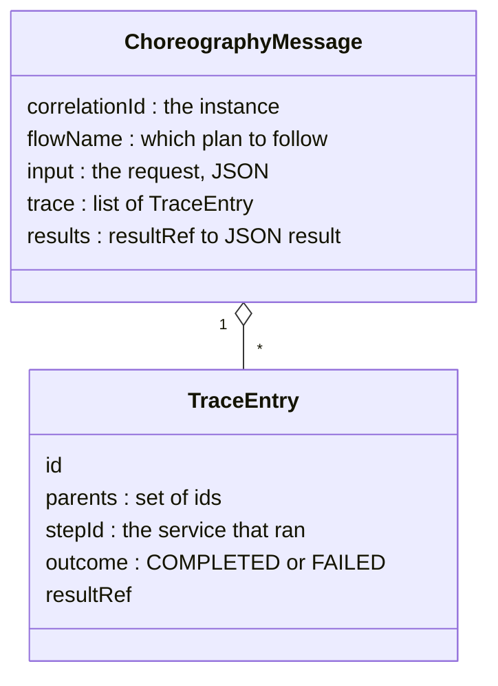
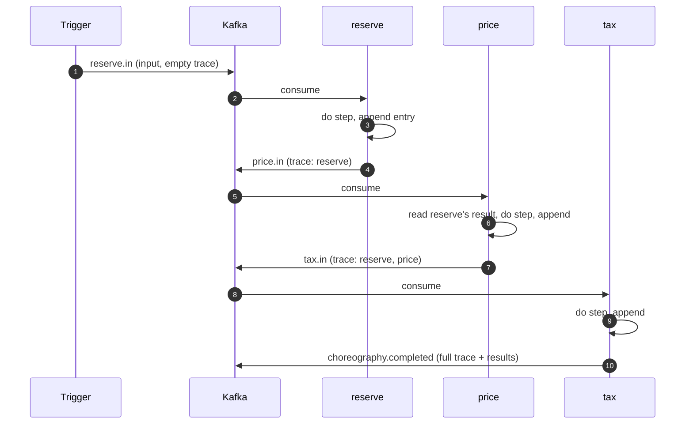
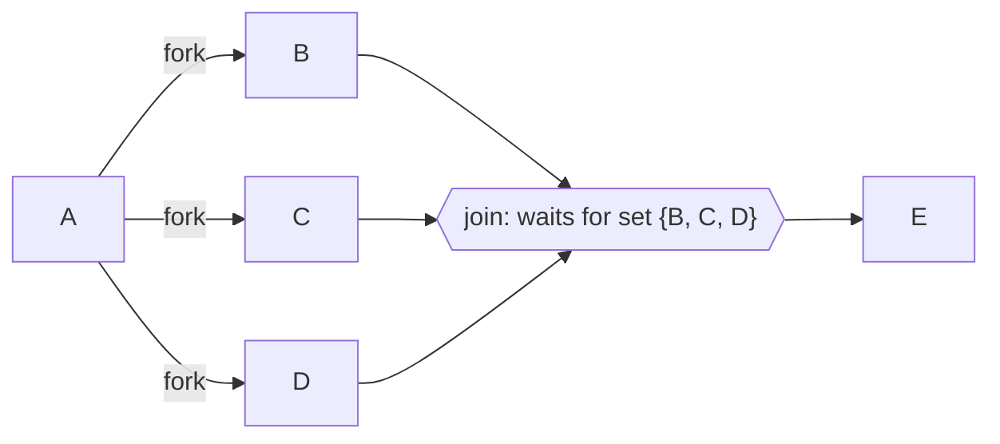
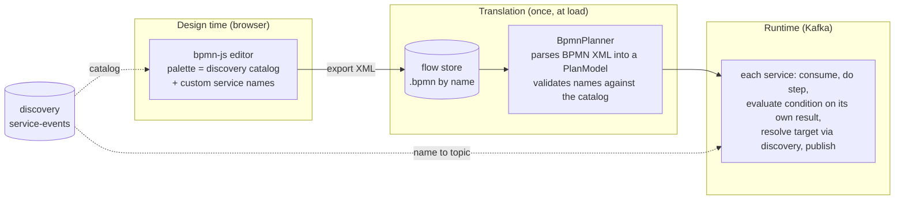

# EDA Choreography Engine

This repository is the runtime half of my thesis. I am building a **decentralized
choreography engine** for event-driven microservices. A workflow is drawn as a BPMN diagram,
translated once into an internal plan, and then executed over Kafka **with no central
orchestrator**. Each service does its step, decides where the work goes next, and hands it on.

The other half is a service discovery platform (`microservice-discovery-k8s`). I treat it as a
black box: the engine only consumes its `service-events` Kafka stream through its own DTO, and
never imports discovery code.

## The problem

In an *orchestrated* workflow, one central component calls every service in turn. It knows the
whole state, and it can undo things when a step fails. It is also a bottleneck and a single
point of failure, and every service is coupled to it.

In a *choreographed* workflow, there is no such component. Services react to messages and
publish new ones. This scales and decouples well, but it raises a hard question: **when
something fails halfway, who knows what has to be undone, and in what order?**

The question gets harder with parallelism. When a workflow forks into branches and one branch
fails, the sibling branches that already succeeded must be undone too. And the steps before
the fork must be undone only after all of them.

## My contribution: fork-aware compensation without a coordinator

Every message carries the **execution trace** of its instance: which steps have run and which
steps triggered them. Because of forks and joins, this trace is a directed acyclic graph, not
a list. When a failure happens, I rebuild the graph from the message alone and undo the
completed steps in **reverse topological order**:

- a step is undone only after everything that came after it has been undone;
- parallel siblings have no order among themselves, so they can be undone concurrently;
- the step that failed has nothing to undo.





D failed, so it committed nothing and is skipped. B and C succeeded and are siblings, so they
are undone first, in either order. A is undone last, because both B and C depended on it.

## The message is a routing slip

I implement choreography with a variant of the **routing slip** pattern. In the classic
pattern, the message carries the list of steps it still has to visit. Mine carries a pointer
to *where it may go* (the flow) and a record of *where it has been* (the trace). Each service
works out the next hop itself, from its own result.



Each design choice in the message serves one purpose:

- **The trace travels as full ancestry.** Any service can rebuild the instance's history, and
  its compensation order, without a shared store.
- **Results are JSON objects keyed by the entry that produced them.** Conditions can test their
  fields. Parallel branches never overwrite each other, and a join merges branches by taking
  the union of their traces and results.
- **A new entry's parents are the trace's current leaves.** That is the previous step on a
  linear path, and every branch end at a join. The same rule covers every shape.
- **Entry ids are derived from the instance, the step and its parents.** Kafka delivers at
  least once. If a service processes the same message twice, it records the same entry, and
  the duplicate collapses instead of forking the history.

## How a flow runs

Every service runs the same small loop: consume, do the step, append to the trace, decide the
next hop, publish. There is no orchestrator in the picture.



Every record is keyed by the correlation id, so one instance's messages stay on one partition
and arrive in order. A service commits its input only after the next message is accepted by
the broker. A crash in between causes a redelivery, never a lost hop.

### Forks and joins

A fork publishes the same message to several next steps. A join waits until **every** branch
has arrived. It counts arrivals as a **set of branch ids, not a counter**, because a
redelivered branch would otherwise be counted twice and fire the join early. The join fires
exactly once. A late duplicate is recognized as a duplicate instead of opening a new join.



## From diagram to running choreography

Authoring and execution are separated by a stored `.bpmn` file and a flow name.



1. **Design.** In a `bpmn-js` editor, I draw a workflow from the services discovery knows
   about. I can also add a task whose service does not exist yet, by typing its logical name.
   The editor exports BPMN XML and never executes anything.
2. **Translate.** The planner parses the XML with `camunda-bpmn-model`, a parsing library, not
   the Camunda engine, and builds the plan the runtime executes:
   - tasks become logical service names;
   - exclusive gateways become conditions;
   - parallel gateways become forks and joins.

   Names discovery knows are bound. Unknown names are either late-bound, resolved at runtime
   if the service ever appears, or rejected when the plan is structurally invalid.
3. **Run.** A request names a flow, and the services choreograph it over Kafka. Each one
   evaluates the outgoing conditions against its own result, resolves the next service's
   topic through discovery, and publishes.

## Scope

**In scope:**
- composing workflows from registered services;
- referencing services that are not registered yet (late binding);
- conditional routing, forks and joins, timeouts;
- fork-aware compensation.

**Out of scope:**
- generating or deploying new service implementations from a diagram;
- partial (N-of-M) joins;
- nested or dynamic forks;
- cancelling a sibling branch that is still in flight. It is allowed to finish and is then
  compensated.

## How I build it

I build the engine incrementally and test-first, with a hard boundary inside the code.

```
com.eda.choreography
├── domain/   pure Java: trace graph, compensation order, join, message, step loop
└── infra/    adapters: Kafka, Redis, the discovery stream, HTTP
```

The domain never imports Kafka, Redis, Spring or HTTP, and an ArchUnit test fails the build if
it does. That is what lets me prove the core algorithms with plain unit tests before any broker
exists, and swap infrastructure (an in-memory join store for a Redis one, for example) without
touching the logic. Integration tests run against real Kafka and Redis containers via
Testcontainers.

```bash
mvn test     # unit tests, no Docker
mvn verify   # + container-backed integration tests (*IT), needs Docker
```

Java 17, Spring Boot 4, Spring for Apache Kafka, Testcontainers. This is the same toolchain as
the discovery platform, so both ends of the wire contract are built alike.
